# Experimenting with differentiable rendering

## Introduction

In its most fundamental form, the core idea behind differentiable rendering (DR) is to reformulate/approximate the rendering function so that the output pixels are continuous and smooth (differentiable) with respect to the input parameters (which can be 3D/2D geometry, lighting conditions, material properties, camera positioning, etc).  
Now, by itself, differentiable rendering won't solve all problems depending on what your input represents, for instance, if you're solving for 2D geometry and a shape is on top of another shape, the optimizer will have basically no knowledge of the shape underneath since it's not affecting anything in the output image (thus you get zero gradients for the shape underneath). While this is a fundamental limitation of 2D rendering, there are fixes for such issues (e.g., enforcing a small baseline transparency or soft opacity prior).  

## Signed distance functions (SDFs)

SDFs play a huge part in 2D differentiable rendering (and I'd guess 3D DR too), so we first have to understand how they work.  
In principle, SDFs are really simple: we just want to define a function that, given `x`, `y`, and whatever other parameters your primitive needs (e.g., `Px`, `Py`, `Pradius` for a circle) it returns a new `z` value.  
If this `z` value is positive (>0) then we're inside the primitive, otherwise if it is negative (\<0) we're outside the primitive (hence the *signed* in the name).  

> [!IMPORTANT]
> Sign conventions change across the literature.  
> What I will be using here (positive inside, negative outside) is perfectly valid. But most adopt the opposite (negative inside, positive outside).  
> The boundary is always at $z = 0$, so this choice doesn't affect the output. It just flips the gradient direction during optimization.  
> It is definitely something to be aware of though.

For example, to define a circle, we can use the following:  

$D\left(a_{x},a_{y},b_{x},b_{y}\right)=\sqrt{\left(a_{x}-b_{x}\right)^{2}+\left(a_{y}-b_{y}\right)^{2}}$  
$D_{Circle}\left(v_{x},v_{y},p_{x},\ p_{y},p_{r}\right)=p_{r}-D\left(v_{x},\ v_{y},p_{x},p_{y}\right)$  

Where $v_x,v_y$ are our current grid position, $p_x,p_y$ are the position of our circle, and $p_r$ is the radius of our circle.  
Here we are literally just measuring the distance (the $D$ function) to a point and adding a threshold ($p_r$) to make a circle.  
Obviously, we can also negate the function (which would be $z = -D_{Circle}(...)$) so that negative is inside the shape and positive is outside.  
Now, if we graph it, we get the following:  

```
<SDFInteractiveGraph
	configs={{
		bounds: {
			min: [-100, -100],
			max: [100, 100],
		},
		params: [
			{id: "x", name: "Px", min: -100, max: 100},
			{id: "y", name: "Py", min: -100, max: 100},
			{id: "r", name: "Pr", min: 0, max: 100},
		],
		func: (vx, vy, params) => {
			const dist = (ax, ay, bx, by) => Math.sqrt((ax - bx) ** 2 + (ay - by) ** 2)
			return params.r - dist(vx, vy, params.x, params.y)
		},
	}}
/>
```

Now, notice how, when the function isn't normalized, it defines a gradient in which the sign indicates whether we are inside or outside the shape. You'll notice the undulating stripes in the visualization, those are the sine of the function output ($sin(z)$). They don't have a specific use in our case, but they do visually encode the gradient field, making it easier to see how the SDF changes smoothly across space.  
Of course we will lose the full gradients when we squish the function by normalizing it, but the gradients will live within the slope of that normalization function.
The fact that the magnitude of `z` equals the distance to the closest surface is what makes them so useful for differentiable rendering, because the gradient magnitude is consistent everywhere, it never vanishes or explodes.  
Obviously, we aren't limited to just circles, we can make basically any primitive, or make them intersect, unify, subtract, and so much more.  
For instance:

| Operation    | Function (>0 in, \<0 out) | Function (\<0 in, >0 out) |
|--------------|---------------------------|---------------------------|
| Union        | $max(a, b)$               | $min(a, b)$               |
| Intersection | $min(a, b)$               | $max(a, b)$               |
| Subtraction  | $min(a, -b)$              | $max(a, -b)$              |

Where $a,b$ are two SDFs

> [!TIP]
> If you want a short example of what SDFs are capable of, check Inigo Quilez's [articles](https://iquilezles.org/articles/) about SDFs, they have SDF collections for both [2D](https://iquilezles.org/articles/distfunctions2d/) and [3D](https://iquilezles.org/articles/distfunctions/) SDFs plus tons of more impressive works.

## SDFs in PyTorch

> [!NOTE]
> Before we begin this section, note that the Python Notebook for this is available [here](sdf_primitives.ipynb).  
> Just in case you're like me and would much rather read code over yapping.

### Defining the grid

Much like in GPUs were each pixel is evaluated in parallel, the exact same can be done in PyTorch.  
So we can begin by defining a grid with size (width, height) in the range (0-width, 0-height), like so:  

```py
import torch
import torch.nn as nn
import matplotlib.pyplot as plt

def plot_output(ax, value, title = None, **kwargs):
    ax.imshow(value.detach().cpu().numpy(), **kwargs)
    if title: ax.set_title(title)
    ax.axis("off")

grid_size = (64, 64)

grid_x_vals, grid_y_vals = [torch.arange(sz, dtype=torch.float32) for sz in grid_size]
grid_y, grid_x = torch.meshgrid(grid_x_vals, grid_y_vals, indexing="ij")

fig, axes = plt.subplots(1, 3, figsize=(12, 3 * 2.6))

plot_output(axes[0], grid_x, f"Grid X")
plot_output(axes[1], grid_y, f"Grid Y")

def normalize(t):
    t_min, t_max = t.min(), t.max()
    return (t - t_min) / (t_max - t_min + 1e-8)

red = normalize(grid_x)
green = normalize(grid_y)
blue = torch.zeros_like(red)

plot_output(axes[2], torch.stack([red, green, blue], axis=-1), f"Grid X and Y")

fig.tight_layout()
plt.tight_layout()
plt.show()
plt.close()
```

This gives us the following:
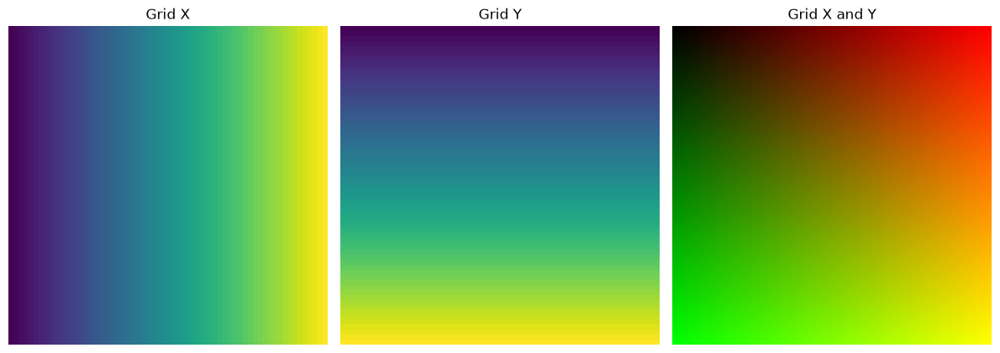

### Applying a SDF function to it

Now we can simply apply a SDF function to each one of those values (much like how you would do in a GPU shader).  
So using the following code:

```py
pos_x = 32.0
pos_y = 32.0
radius = 8.0

def sdf_circle(grid_x: torch.Tensor, grid_y: torch.Tensor, pos_x, pos_y, radius):
  return radius - torch.sqrt((grid_x - pos_x + 1e-4) ** 2 + (grid_y - pos_y + 1e-4) ** 2)

def smoothstep(edge0: torch.Tensor, edge1: torch.Tensor, x: torch.Tensor) -> torch.Tensor:
  t = torch.clamp((x - edge0) / (edge1 - edge0 + 1e-4), 0.0, 1.0)
  return t * t * (3.0 - 2.0 * t)

def norm_atan(sdf): return torch.atan(sdf) / torch.pi + 0.5
def norm_atanx4(sdf): return torch.atan(sdf * 4) / torch.pi + 0.5
def norm_tanh(sdf): return torch.tanh(sdf) / 2 + 0.5
def norm_sigmoid(sdf): return torch.sigmoid(sdf)
def norm_smoothstep(sdf): return smoothstep(-0.5, 0.5, sdf)

sdf_raw = sdf_circle(grid_x, grid_y, pos_x, pos_y, radius)
sdf_atan = norm_atan(sdf_raw)
sdf_atanx4 = norm_atanx4(sdf_raw)
sdf_tanh = norm_tanh(sdf_raw)
sdf_sigmoid = norm_sigmoid(sdf_raw)
sdf_smoothstep = norm_smoothstep(sdf_raw)

fig, axes = plt.subplots(1, 6, figsize=(16, 6))

def plot_sdf_normalizations(axes):
  plot_output(axes[0], sdf_raw, f"Circle SDF (raw)", vmin=0, vmax=1)
  plot_output(axes[1], sdf_atan, f"Circle SDF (atan)", vmin=0, vmax=1)
  plot_output(axes[2], sdf_atanx4, f"Circle SDF (atanx4)", vmin=0, vmax=1)
  plot_output(axes[3], sdf_tanh, f"Circle SDF (tanh)", vmin=0, vmax=1)
  plot_output(axes[4], sdf_sigmoid, f"Circle SDF (sigmoid)", vmin=0, vmax=1)
  plot_output(axes[5], sdf_smoothstep, f"Circle SDF (smoothstep)", vmin=0, vmax=1)

plot_sdf_normalizations(axes)

fig.tight_layout()
plt.tight_layout()
plt.show()
plt.close()
```

This pretty much just evaluates the SDF for every point in our grid, so we're feeding that entire 64x64 grid to the SDF, the SDF calculates a new value (our $z$) for every point, and returns a new 64x64 grid.

We get the following:
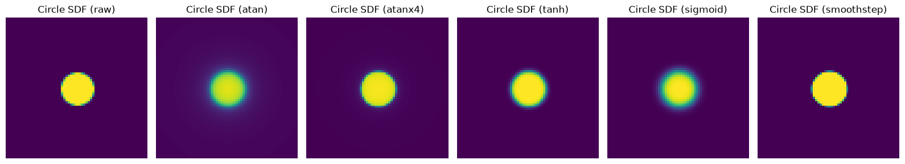

I don't think I need to mention this, you are not limited to these functions, you can use practically any normalization function (keep in mind it might change how things work drastically even if visually it looks the same, we will see this happening in action later on).

### Creating a simple target image

So we have to define a target to optimize for, lets begin by just using a circle (which can be defined by our own circle SDF).

```py
target = sdf_circle(grid_x, grid_y, pos_x * 1.5, pos_y * 1.5, radius).clamp(-1, 1) / 2 + 0.5
fig, axes = plt.subplots(1, 1, figsize=(2.6, 2.6))

plot_output(axes, target, f"Image target", vmin=0, vmax=1)

fig.tight_layout()
plt.tight_layout()
plt.show()
plt.close()
```

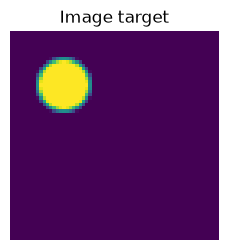

### Visualizing the function gradients

Now before our first training run, I think it would be neat to see how the gradients vary across the functions.  
The good thing about circles is that we only have 3 parameters that we can touch ($p_x$, $p_y$, $p_r$), thus we can lock $p_r$ and create a 2D vector field to see how the gradients will flow.  

So how do we do that?
Well it's actually quite straightforward:  

1. The gradient is basically back-propagation telling us how we should change our parameters (so it's a delta). Thus we start by defining a tensor that stores that delta (same size as the amount of parameters), for every sample we want to get, and for every type of function we have (which is 6: `raw`, `atan`, `atanx4`, `tanh`, `sigmoid`, `smoothstep`). We do the same with loss, but loss is accounted by a single number.
2. We iterate every point we would like to sample and track their index (we have to know which sample the current gradient vector and loss belongs to).
3. We define our parameters for the current sample. In this case it is the current circle position (so $p_x$ and $p_y$).
4. We compute `sdf_raw` and then every other function type.
5. Now things get interesting because we call `write_grad`. The first arguments are just info about which sample we're solving for, then the resulting value from our function, and finally the parameters we want to get the gradients for.
6. Inside `write_grad` we calculate the L2 loss and get the gradients using `torch.autograd.grad`, this function is very interesting because it only differentiates for parameters we manually gave it (the `params` variable, so $p_x$ and $p_y$), it then returns the gradients as a list of tensors. At no point do we have to deal with hidden states, `.grad.zero_()`, or something else. We also have to use `retain_graph = True` otherwise PyTorch would free the compute graph after the first `torch.autograd.grad` call.
7. We then store those values and graph them.

I won't get into the graphing part because it's really just about negating the gradients (by default the gradients go *up* we want to go *down*), scaling them, and plotting them.

```py
# [types, grid_x, grid_y, parameters]
vector_field = torch.empty((6, *grid_size, 2))
# [types, grid_x, grid_y, 1]
loss_field = torch.empty((6, *grid_size, 1))

def write_grad(idx: int, gx_idx: int, gy_idx: int, sdf: torch.Tensor, params: list[torch.Tensor]):
  loss_l2 = nn.functional.mse_loss(sdf, target)
  gradients = torch.autograd.grad(loss_l2, params, retain_graph=True, allow_unused=True)
  vector_field[idx, gx_idx, gy_idx] = torch.tensor(gradients, dtype=torch.float)
  loss_field[idx, gx_idx, gy_idx] = loss_l2.detach().clone()

for gx_idx in range(grid_size[0]):
  for gy_idx in range(grid_size[1]):
    gx_val = grid_x[gx_idx, gy_idx].detach().clone().requires_grad_(True)
    gy_val = grid_y[gx_idx, gy_idx].detach().clone().requires_grad_(True)

    sdf_raw = sdf_circle(grid_x, grid_y, gx_val, gy_val, radius)
    sdf_atan = norm_atan(sdf_raw)
    sdf_atanx4 = norm_atanx4(sdf_raw)
    sdf_tanh = norm_tanh(sdf_raw)
    sdf_sigmoid = norm_sigmoid(sdf_raw)
    sdf_smoothstep = norm_smoothstep(sdf_raw)

    write_grad(0, gx_idx, gy_idx, sdf_raw, [gx_val, gy_val])
    write_grad(1, gx_idx, gy_idx, sdf_atan, [gx_val, gy_val])
    write_grad(2, gx_idx, gy_idx, sdf_atanx4, [gx_val, gy_val])
    write_grad(3, gx_idx, gy_idx, sdf_tanh, [gx_val, gy_val])
    write_grad(4, gx_idx, gy_idx, sdf_sigmoid, [gx_val, gy_val])
    write_grad(5, gx_idx, gy_idx, sdf_smoothstep, [gx_val, gy_val])

sdf_titles = ["raw", "atan", "atanx4", "tanh", "sigmoid", "smoothstep"]
fig, axes = plt.subplots(2, len(sdf_titles), figsize=(15 * len(sdf_titles), 6 * 4))

def plot_grad_quiver(ax, grid_x, grid_y, plot_x, plot_y, color, title, scale):
  ax.pcolormesh(grid_x, grid_y, color, cmap="viridis", shading="auto", alpha=1)
  ax.quiver(grid_x, grid_y, plot_x, -plot_y, color, cmap="grey", scale=scale, alpha=1)
  ax.set_xlabel("x")
  ax.set_ylabel("y")
  ax.set_title(title)
  ax.grid(alpha=0.3)
  ax.set_aspect("equal", adjustable="box")
  ax.invert_yaxis()

def plot_grad_stream(ax, grid_x, grid_y, plot_x, plot_y, color, title, scale):
  grid_x_np = grid_x.detach().cpu().numpy() if torch.is_tensor(grid_x) else grid_x
  grid_y_np = grid_y.detach().cpu().numpy() if torch.is_tensor(grid_y) else grid_y
  plot_x_np = plot_x.detach().cpu().numpy() if torch.is_tensor(plot_x) else plot_x
  plot_y_np = plot_y.detach().cpu().numpy() if torch.is_tensor(plot_y) else plot_y
  color_np = color.detach().cpu().numpy() if torch.is_tensor(color) else color

  ax.streamplot(grid_x_np, grid_y_np, plot_x_np, plot_y_np, color=color_np, cmap="viridis", density=2, num_arrows=16, broken_streamlines=False)
  ax.set_xlabel("x")
  ax.set_ylabel("y")
  ax.set_title(title)
  ax.grid(alpha=0.3)
  ax.set_aspect("equal", adjustable="box")
  ax.invert_yaxis()

for idx, name in enumerate(sdf_titles):
  vx = vector_field[idx, :, :, 0]
  vy = vector_field[idx, :, :, 1]

  magnitude = torch.sqrt(vx ** 2 + vy ** 2)
  vx_normalized = torch.where(magnitude <= 1e-6, torch.tensor(0.0), vx / magnitude)
  vy_normalized = torch.where(magnitude <= 1e-6, torch.tensor(0.0), vy / magnitude)

  fixed_display_length = 0.05
  vx_plot = fixed_display_length * vx_normalized
  vy_plot = fixed_display_length * vy_normalized
  color = loss_field[idx, :, :].squeeze(-1)

  plot_grad_stream(axes[0, idx], grid_x, grid_y, -vx, -vy, color, f"Stream gradient ({name})", scale=0.25)
  plot_grad_quiver(axes[1, idx], grid_x, grid_y, -vx_plot, -vy_plot, color, f"Quiver gradient ({name})", scale=1.50)

fig.tight_layout()
plt.show()
plt.close()
```

This gives us the following graph (feel free to zoom in):
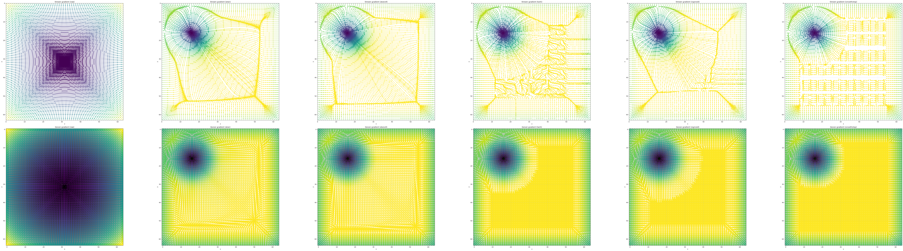

Now even with just this graph we can see some very interesting things and possible issues.  
What I would like to point out is:  

1. How with the raw non-normalized SDF we get a direct un-scaled gradient to the target, which is way stronger than with normalization. This makes sense, because the $z$ value that our SDF returns represents the distance to 0. Obviously since our optimization target doesn't operate in the same range as the SDF (the numerical range for our target is 0 to 1, while SDFs don't have a singular range) the solution with the lowest loss is to set the circle in the middle.
2. All functions give us valid gradients only around their optimization range, with the exception of `atan` and `atanx4` which provides decent gradients for a bigger range than the others (which makes sense since it decays slowly).
3. How the truly meaningful gradients are close to the optimization target.

Now even with these issues, these functions will probably all perform relatively well because that they produce a small area around them with decent gradients. While this would be a deal breaker basically anywhere else in ML, in this scenario we don't actually need fully continuous gradients, because having the optimizer trying to optimize every shape for the entire image is unnecessary. This way the optimizer will try to fit shapes to their closest pixel.  
We will actually see this exact issue of the optimizer being "too greedy" happening with `atan` and `atanx4` later on.  

### First test runs

So now we can move to our first test runs.  
For that I wrote this test bench:

```py
import os, subprocess
from PIL import Image
from tqdm import tqdm

def convert_figure(fig):
  fig.canvas.draw()
  buffer = fig.canvas.buffer_rgba()
  sx, sy = fig.canvas.get_width_height()

  return Image.frombuffer("RGBA", (sx, sy), buffer, "raw", "RGBA", 0, 1)

def perform_combination_test(
  perform_run_fn,
  definition_list,
  definition_names,
  combination_list,
):
  for test_list_idx, test_case in enumerate(combination_list):
    test_enable = test_case["enable"]
    test_steps = test_case["steps"]
    test_name = test_case["name"]
    test_list = test_case["tests"]
    test_count = len(test_list)
    test_samples = []

    format_frame = "ppm"
    format_final = "webp"

    if not test_enable:
      continue

    for item in test_list:
      kw_args = {definition_names[idx]: definition_list[idx][key] for idx, key in enumerate(item)}
      samples = perform_run_fn(**kw_args, steps = test_steps)

      test_samples.append(samples)

    for sample_batch in tqdm(zip(*test_samples)):
      fig, axes = plt.subplots(2, test_count, figsize=(3 * test_count, 2.6 * 2))

      for test_idx, (step, sdf_norm, sdf_target, loss) in enumerate(sample_batch):
        run_setup = ", ".join(test_list[test_idx])
        plot_output(axes[0, test_idx], sdf_norm, f"{run_setup}\n[{step}] Loss: {loss:.6f}\nApprox", vmin=0, vmax=1)
        plot_output(axes[1, test_idx], sdf_norm - sdf_target, "Difference", vmin=-1, vmax=1)
        del sdf_norm

      fig.tight_layout()
      plt.tight_layout()
      convert_figure(fig).save(f"{test_name}.{step}.{format_frame}")
      plt.close()

    ffmpeg_cmd = f"ffmpeg -i '{test_name}.%d.{format_frame}' -framerate 25 -c:v libwebp -loop 0 {test_name}.{format_final} -y"
    print(subprocess.getoutput(ffmpeg_cmd))

    for idx in range(test_steps):
      os.remove(f"{test_name}.{idx}.{format_frame}")

norm_table = {
  "smoothstep": norm_smoothstep,
  "atan": norm_atan,
  "atanx1.5": lambda sdf: torch.atan(sdf * 1.5) / torch.pi + 0.5,
  "atanx2": lambda sdf: torch.atan(sdf * 2) / torch.pi + 0.5,
  "atanx3": lambda sdf: torch.atan(sdf * 3) / torch.pi + 0.5,
  "atanx4": norm_atanx4,
  "tanh": norm_tanh,
  "sigmoid": norm_sigmoid,
}
optimizer_table = {
  "rmsprop": (torch.optim.RMSprop, { "lr": 0.1, "momentum": 0.5 }),
  "adam": (torch.optim.Adam, { "lr": 2.0, "betas": (0.95, 0.999) }),
  "adamw": (torch.optim.AdamW, { "lr": 2.0, "betas": (0.95, 0.999) }),
}
circle_init_table = {
  "centered": (30.0, 30.0, 8.0),
  "offset": (48.0, 48.0, 8.0),
}

def perform_circle_run(norm_setup, optim_setup, vars_setup, steps):
  print(norm_setup, optim_setup, vars_setup, steps)
  px_init, py_init, rad_init = vars_setup
  p_x = nn.Parameter(torch.tensor(px_init))
  p_y = nn.Parameter(torch.tensor(py_init))
  p_radius = nn.Parameter(torch.tensor(rad_init))

  optim_module, optim_params = optim_setup

  optimizer = optim_module([p_x, p_y, p_radius], **optim_params)

  for step in range(steps):
    optimizer.zero_grad()
    p_radius.data.clamp_(1, 64)
    sdf_raw = sdf_circle(grid_x, grid_y, p_x, p_y, p_radius)
    sdf_norm = norm_setup(sdf_raw)
    loss = nn.functional.mse_loss(sdf_norm, target)

    loss.backward()
    optimizer.step()

    yield (step, sdf_norm.detach().clone().cpu(), target, loss.item())

perform_combination_test(
  perform_circle_run,
  [norm_table, optimizer_table, circle_init_table],
  ["norm_setup", "optim_setup", "vars_setup"],
  [
    dict(
      enable = True, steps = 200,
      name = "test-run-centered-rmsprop",
      tests = [
        ("smoothstep", "rmsprop", "centered"),
        ("atan", "rmsprop", "centered"),
        ("atanx4", "rmsprop", "centered"),
        ("tanh", "rmsprop", "centered"),
        ("sigmoid", "rmsprop", "centered"),
      ]
    ),
    dict(
      enable = True, steps = 200,
      name = "test-run-centered-adam",
      tests = [
        ("smoothstep", "adam", "centered"),
        ("atan", "adam", "centered"),
        ("atanx4", "adam", "centered"),
        ("tanh", "adam", "centered"),
        ("sigmoid", "adam", "centered"),
      ]
    ),
    dict(
      enable = True, steps = 200,
      name = "test-run-offcenter-adam",
      tests = [
        ("smoothstep", "adam", "offset"),
        ("atan", "adam", "offset"),
        ("atanx4", "adam", "offset"),
        ("tanh", "adam", "offset"),
        ("sigmoid", "adam", "offset"),
      ]
    ),
  ]
)
```

We will initialize our circle with $p_x = 30, p_y = 30$ (labeled as centered in the graph).  
To begin with let's see how RMSprop compares with Adam.  
Here's RMSprop:
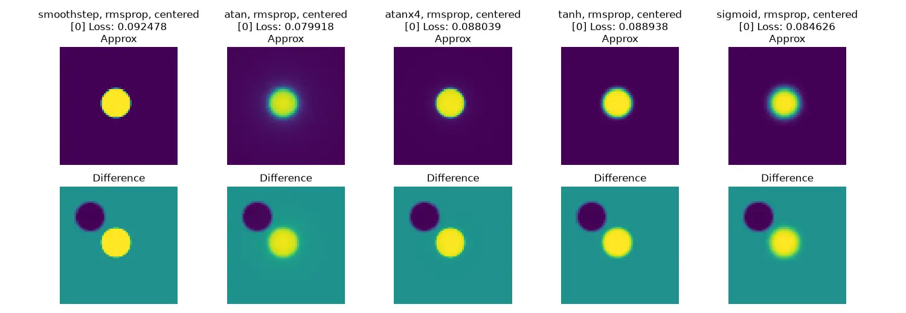
And here's Adam:
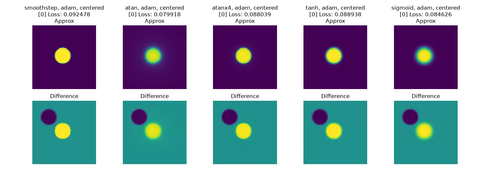
From our very limited sample size and choice of parameters we can tell that Adam does perform slightly better than RMSprop, although RMSprop converges impressively fast while Adam takes its time, which is interesting, probably because of Adam's momentum. It's also interesting to see that `atanx4` fails with RMSprop but converges with Adam.  
Of course though we can't really make many meaningful conclusions from tests like this.  
It's also worth noting that while in this test RMSprop fails on both `smoothstep` and `atanx` in a real scenario it would zero the radius on that circle, effectively signaling it doesn't need it anymore. That's by no means better than it converging, but it's something.

> [!TIP]
> You might have noticed that I'm clamping the radius to a minimum of 1, this is because the optimizer would much rather set the circle radius to 0 to make it invisible, as that's the most straightforward solution given our constraints.  
> Which is also why you can see the optimizer instantly trying to zero it out.

Now we know what happens when the circle is inside the area of valid gradients, but what happens if it isn't?  
Here we using $p_x = 48, p_y = 48$
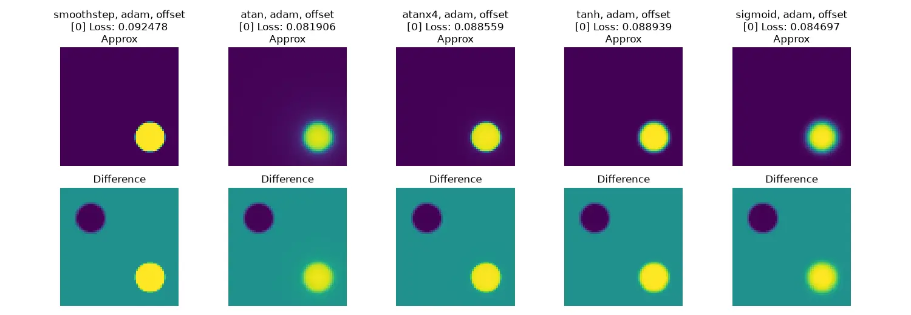
Well, that's interesting, `atan` and `atanx4` converge, makes because their gradients propagate a lot further than the other functions.  

### Multiple objects

So now that we have the foundations down lets use multiple objects and a different line SDF.

We can define it like so:

```py
def tensor_length(v):
  return torch.sqrt(torch.sum(v ** 2, dim=-1) + epsilon)

tensor_dot = torch.linalg.vecdot

def sdf_lines(grid_x: torch.Tensor, grid_y: torch.Tensor, a, b, r):
  grid = torch.cat([grid_x.unsqueeze(-1), grid_y.unsqueeze(-1)], dim=-1).unsqueeze(0)
  a = a[None, None].permute(2, 0, 1, 3)
  b = b[None, None].permute(2, 0, 1, 3)
  pa = (grid - a)
  ba = (b - a)
  h = (tensor_dot(pa, ba) / (tensor_dot(ba, ba) + epsilon)).clamp(0, 1).unsqueeze(-1)
  return -tensor_length(pa - ba * h).permute(1, 2, 0) + r.view(1, 1, -1)

v_a = torch.tensor([[16, 16], [16, 48], [32, 16], [16, 32]], dtype=torch.float32)
v_b = torch.tensor([[48, 48], [48, 16], [32, 48], [48, 32]], dtype=torch.float32)
v_r = torch.tensor([2, 2, 2, 2], dtype=torch.float32)

sdf_raw = sdf_lines(grid_x, grid_y, v_a, v_b, v_r).max(dim = -1).values
sdf_atan = norm_atan(sdf_raw)
sdf_atanx4 = norm_atanx4(sdf_raw)
sdf_tanh = norm_tanh(sdf_raw)
sdf_sigmoid = norm_sigmoid(sdf_raw)
sdf_smoothstep = norm_smoothstep(sdf_raw)

fig, axes = plt.subplots(1, 6, figsize=(16, 4))

def plot_sdf_normalizations(axes):
  plot_output(axes[0], sdf_raw, f"Lines SDF (raw)", vmin=0, vmax=1)
  plot_output(axes[1], sdf_atan, f"Lines SDF (atan)", vmin=0, vmax=1)
  plot_output(axes[2], sdf_atanx4, f"Lines SDF (atanx4)", vmin=0, vmax=1)
  plot_output(axes[3], sdf_tanh, f"Lines SDF (tanh)", vmin=0, vmax=1)
  plot_output(axes[4], sdf_sigmoid, f"Lines SDF (sigmoid)", vmin=0, vmax=1)
  plot_output(axes[5], sdf_smoothstep, f"Lines SDF (smoothstep)", vmin=0, vmax=1)

plot_sdf_normalizations(axes)

fig.tight_layout()
plt.tight_layout()
plt.show()
plt.close()
```

Notice how we're using a simple `.max(dim = -1).values` to make a union of all our values.

That gives us the following:
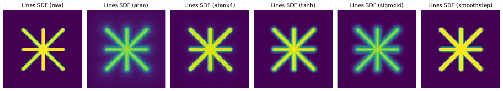

Using the exact same method for the circle SDF we can make it into an optimization target:
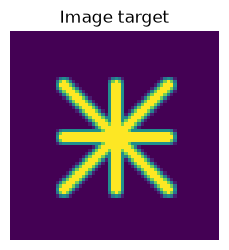

And once again, we can optimize for it

```py
line_init_table = {
  "rand": (
    [
      [50.89, 23.34], [44.91, 39.6], [59.01, 6.8], [28.55, 54.38],
      [42.0, 27.78], [5.16, 37.02], [4.78, 31.15], [48.51, 27.39],
      [36.28, 38.34], [3.47, 60.99], [5.04, 23.43], [4.98, 14.56],
      [38.42, 61.63], [61.46, 45.84], [20.01, 21.14], [30.59, 48.86]
    ],
    [
      [48.27, 21.45], [42.89, 41.65], [57.23, 10.7], [27.78, 65.48],
      [44.05, 34.26], [2.07, 35.97], [1.67, 33.31], [46.59, 28.99],
      [32.15, 47.97], [-2.64, 57.56], [11.03, 20.25], [9.8, 14.4],
      [44.39, 61.34], [58.65, 44.1], [20.69, 25.45], [21.08, 46.08]
    ],
    [
      1.5154, 1.1777, 0.6993, 0.8052, 1.0716, 0.6328, 0.6741, 0.3321,
      0.3307, 0.6558, 1.3163, 1.5220, 1.5364, 1.9526, 0.9107, 0.9901
    ],
  )
}
line_optimizer_table = {
  "rmsprop": (torch.optim.RMSprop, { "lr": 0.1, "momentum": 0.5 }),
  "adam": (torch.optim.Adam, { "lr": 0.5, "betas": (0.95, 0.999) }),
  "adamw": (torch.optim.AdamW, { "lr": 0.5, "betas": (0.95, 0.999) }),
}

def perform_line_run(norm_setup, optim_setup, vars_setup, steps):
  print(norm_setup, optim_setup, vars_setup, steps)
  pa_init, pb_init, rad_init = vars_setup
  p_a = nn.Parameter(torch.tensor(pa_init, dtype=torch.float32))
  p_b = nn.Parameter(torch.tensor(pb_init, dtype=torch.float32))
  p_radius = nn.Parameter(torch.tensor(rad_init))

  optim_module, optim_params = optim_setup

  optimizer = optim_module([p_a, p_b, p_radius], **optim_params)

  for step in range(steps):
    optimizer.zero_grad()
    sdf_raw = sdf_lines(grid_x, grid_y, p_a, p_b, p_radius).max(dim=-1).values
    sdf_norm = norm_setup(sdf_raw)
    loss = nn.functional.mse_loss(sdf_norm, line_target)

    loss.backward()
    optimizer.step()

    yield (step, sdf_norm.detach().clone().cpu(), line_target, loss.item())

perform_combination_test(
  perform_line_run,
  [norm_table, line_optimizer_table, line_init_table],
  ["norm_setup", "optim_setup", "vars_setup"],
  [
    dict(
      enable = True, steps = 200,
      name = "line-run-rand-adam",
      tests = [
        ("smoothstep", "adam", "rand"),
        ("atan", "adam", "rand"),
        ("atanx4", "adam", "rand"),
        ("tanh", "adam", "rand"),
        ("sigmoid", "adam", "rand"),
      ]
    ),
    dict(
      enable = True, steps = 200,
      name = "line-run-rand-adamw",
      tests = [
        ("smoothstep", "adamw", "rand"),
        ("atan", "adamw", "rand"),
        ("atanx4", "adamw", "rand"),
        ("tanh", "adamw", "rand"),
        ("sigmoid", "adamw", "rand"),
      ]
    ),
    dict(
      enable = True, steps = 200,
      name = "line-run-atanxn-adam",
      tests = [
        ("atan", "adam", "rand"),
        ("atanx1.5", "adam", "rand"),
        ("atanx2", "adam", "rand"),
        ("atanx3", "adam", "rand"),
        ("atanx4", "adam", "rand"),
      ]
    ),
  ]
)
```

Which gives us the following, starting with Adam:

And then AdamW (because we haven't tested it yet):
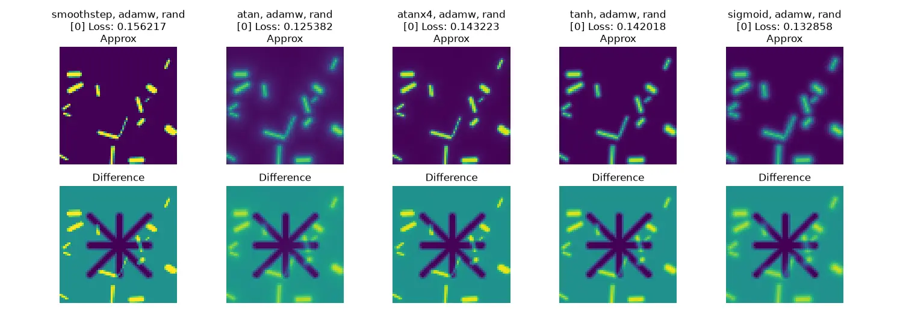

Adam and AdamW perform nearly identically in this case. It's also interesting to note how `sigmoid` surprisingly manages to converge on both Adam and AdamW, it also wins basically over all other functions, maybe with the exception of `atanx4`.  
Interestingly `smoothstep` and `atan` fail to converge on both, so maybe `atan`'s gradients aren't that good at all.  

So now lets see how `atan(xn)` ($\frac{\arctan(x \cdot n)}{\pi} + 0.5$) performs
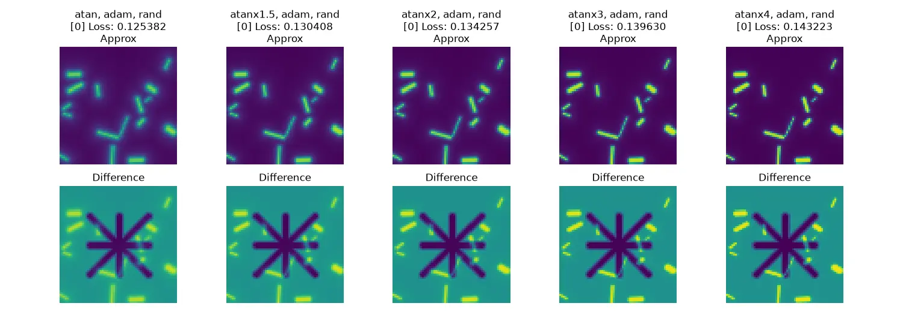

Only `atan` and `atanx3` fail to converge.

### Going Technicolor

Now with the optimization fundamentals out of the way lets add color.  
Adding color is quite straightforward since our `sdf_lines` function returns a tensor of size `[W, H, M]` where `M` is the amount of lines we have.  
So we can use a static canvas and basically write each shape into it, by first subtracting our shape from the canvas (so we get a black void where our shape would go) and then adding it into the canvas (thus filling the void with our shape).  

So this simple function is all we need:

```py
def sdf_compose(masks, colors, bg_color):
  canvas = bg_color.expand(*masks.shape[:2], 3).clone()
  colors = colors.unsqueeze(-1).unsqueeze(-1)
  colors = colors.permute(0, 2, 3, 1)
  masks = masks.permute(2, 0, 1).unsqueeze(-1)

  for mask, color in zip(masks, colors):
    canvas = canvas * (1 - mask) + color * mask

  return canvas
```

> [!TIP]
> Adding alpha can be done by simply pre-multiplying our `mask` with an alpha value.  
> So:
>
> ```py
> blend = mask * alpha
> canvas = canvas * (1 - blend) + color * blend
> ```

With that we achieve colored SDFs, as we can see:
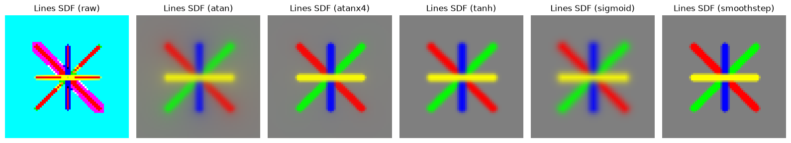

Here's an animation to better visualize the whole "create shape silouette, then color and fill it" concept:
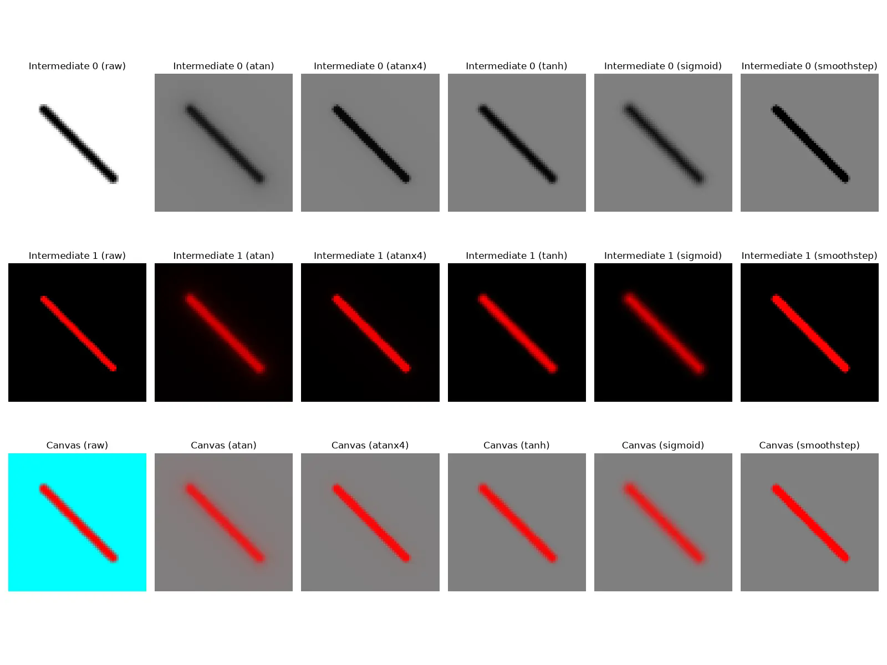
Of course the `raw` canvas is completely broken because we're passing the raw non-normalized SDF values. Which is why it blends improperly.

And for completeness sake the full code used:

```py
def sdf_compose(masks, colors, bg_color):
  canvas = bg_color.expand(*masks.shape[:2], 3).clone()
  colors = colors.unsqueeze(-1).unsqueeze(-1)
  colors = colors.permute(0, 2, 3, 1)
  masks = masks.permute(2, 0, 1).unsqueeze(-1)

  for mask, color in zip(masks, colors):
    canvas = canvas * (1 - mask) + color * mask

  return canvas

def sdf_compose_dbg(masks, colors, bg_color):
  canvas = bg_color.expand(*masks.shape[:2], 3).clone()
  colors = colors.unsqueeze(-1).unsqueeze(-1)
  colors = colors.permute(0, 2, 3, 1)
  masks = masks.permute(2, 0, 1).unsqueeze(-1)

  intermediate_0 = []
  intermediate_1 = []
  canvas_snapshots = []

  for mask, color in zip(masks, colors):
    i_0 = canvas * (1 - mask)
    i_1 = color * mask
    canvas = i_0 + i_1
    intermediate_0.append(i_0.clone())
    intermediate_1.append(i_1.clone())
    canvas_snapshots.append(canvas.clone())

  return canvas, intermediate_0, intermediate_1, canvas_snapshots

v_a = torch.tensor([[16, 16], [16, 48], [32, 16], [16, 32]], dtype=torch.float32)
v_b = torch.tensor([[48, 48], [48, 16], [32, 48], [48, 32]], dtype=torch.float32)
v_r = torch.tensor([2, 2, 2, 2], dtype=torch.float32)
v_c = torch.tensor([[1, 0, 0], [0, 1, 0], [0, 0, 1], [1, 1, 0]], dtype=torch.float32)
v_bg = torch.tensor([0.5, 0.5, 0.5], dtype=torch.float32)

sdf_src = sdf_lines(grid_x, grid_y, v_a, v_b, v_r)
sdf_raw = sdf_compose_dbg(sdf_src, v_c, v_bg)
sdf_atan = sdf_compose_dbg(norm_atan(sdf_src), v_c, v_bg)
sdf_atanx4 = sdf_compose_dbg(norm_atanx4(sdf_src), v_c, v_bg)
sdf_tanh = sdf_compose_dbg(norm_tanh(sdf_src), v_c, v_bg)
sdf_sigmoid = sdf_compose_dbg(norm_sigmoid(sdf_src), v_c, v_bg)
sdf_smoothstep = sdf_compose_dbg(norm_smoothstep(sdf_src), v_c, v_bg)

norm_funcs = ["raw", "atan", "atanx4", "tanh", "sigmoid", "smoothstep"]
norm_list = [sdf_raw, sdf_atan, sdf_atanx4, sdf_tanh, sdf_sigmoid, sdf_smoothstep]

fig, axes = plt.subplots(1, len(norm_funcs), figsize=(16, 4))

def plot_sdf_normalizations(axes):
  for norm_idx, norm_name in enumerate(norm_funcs):
    norm_item = norm_list[norm_idx]
    plot_output(axes[norm_idx], norm_item[0], f"Lines SDF ({norm_name})", vmin=0, vmax=1)

plot_sdf_normalizations(axes)

fig.tight_layout()
plt.tight_layout()
plt.show()
plt.close()

for frame_idx in range(v_r.shape[0]):
  fig, axes = plt.subplots(3, len(norm_funcs), figsize=(16, 4 * 3))

  for norm_idx, norm_name in enumerate(norm_funcs):
    norm_item = norm_list[norm_idx]
    plot_output(axes[0, norm_idx], norm_item[1][frame_idx], f"Intermediate 0 ({norm_name})", vmin=0, vmax=1)
    plot_output(axes[1, norm_idx], norm_item[2][frame_idx], f"Intermediate 1 ({norm_name})", vmin=0, vmax=1)
    plot_output(axes[2, norm_idx], norm_item[3][frame_idx], f"Canvas ({norm_name})", vmin=0, vmax=1)

  fig.tight_layout()
  plt.tight_layout()
  plt.savefig(f"frame-{frame_idx}.png")
  plt.close()

ffmpeg_cmd = f"ffmpeg -framerate 1 -i 'frame-%d.png' -c:v libwebp -loop 0 rgb-composition-animated.webp -y"
print(subprocess.getoutput(ffmpeg_cmd))

for idx in range(v_r.shape[0]):
  os.remove(f"frame-{idx}.png")
```

### Optimizing in color

Once again, we create a target:  
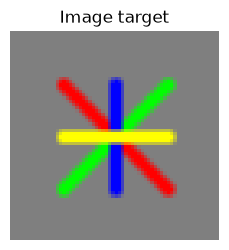

And then we optimize for it:  


And again `sigmoid` is the one that gets the closest to convergence first, surprisingly most of the functions get close to convergence, but sigmoid gets there pretty fast.  
You also might have noticed that it's a lot slower now, that's because I dropped the LR since the previous value was too violent for this many variables.  
It's also worth noting that it uses 2 lines for the diagonal line instead of 1, while wasteful, this is a totally valid approach to optimizing this problem.  
Here's how it looks when using $\arctan(x \cdot n)$:
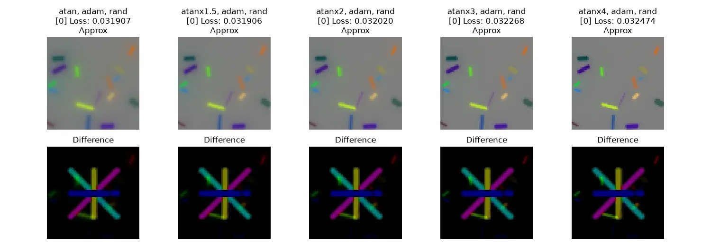

Interesting how `atanx1.5` and `atanx2` basically fully converge.  

And when using RMSprop:
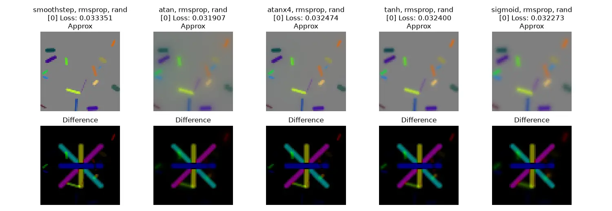
Clearly the LR is too high, but even then it does give interesting results.

## Large scale demo

Now with the fundamentals out of the way we can finally scale up to real images.  

For that I will use these images as optimization targets:  
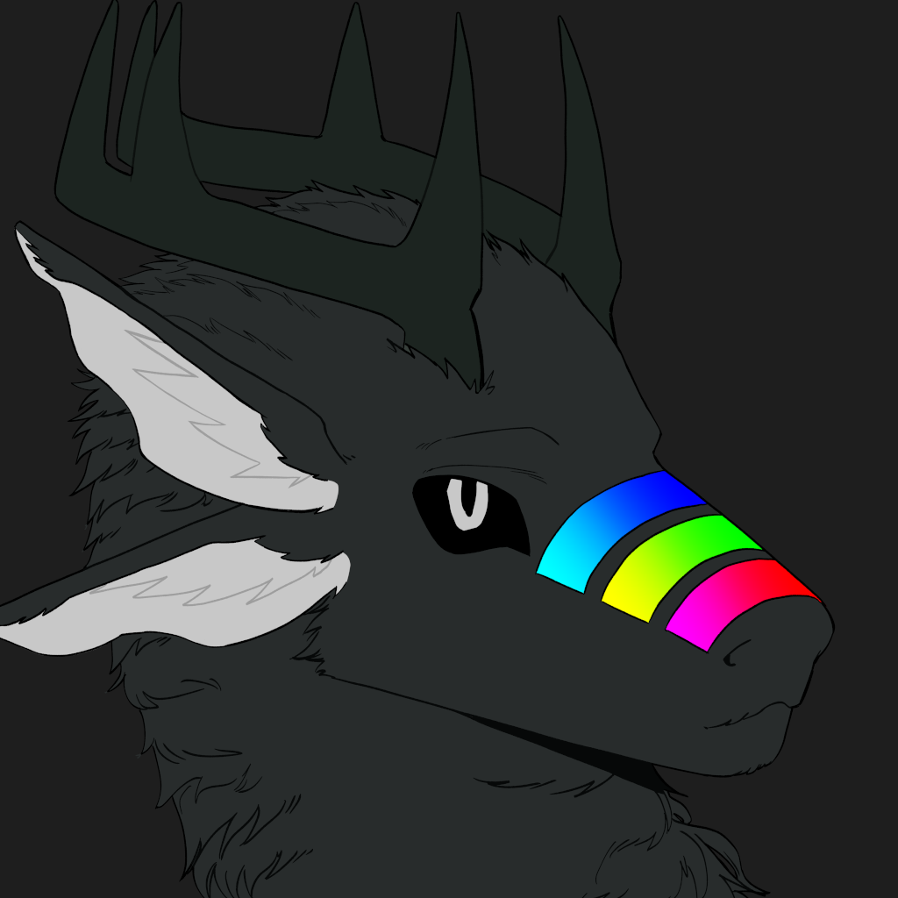
<br/>
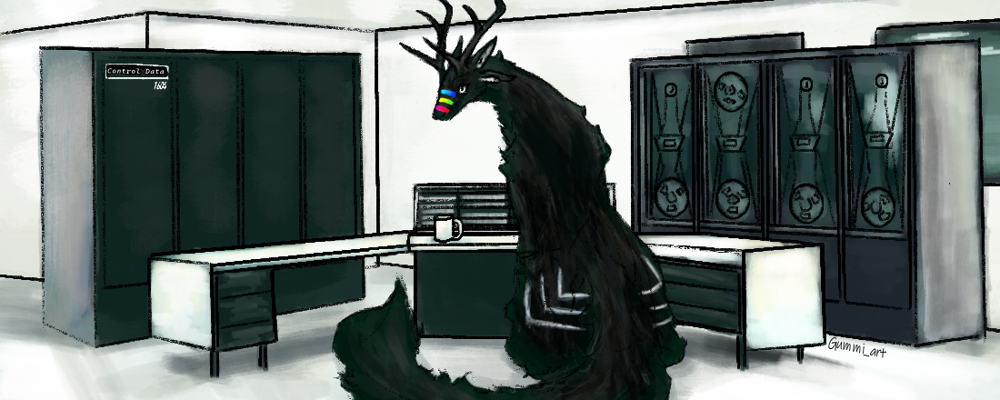

Based on what we understand now, I put together the following script:
\<CodeEmbed language="python" source="optimizer_simple.py"/>

And well.. It does work..

### Normalization tests

So to begin I'll test multiple normalizations.  
From worst to best

`atan`:  
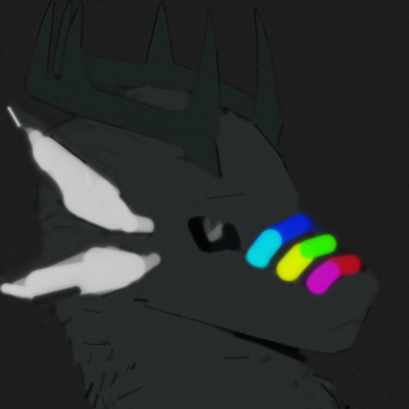
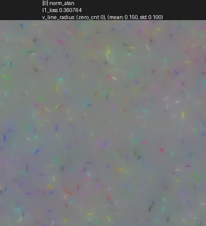

`atanx4`:  

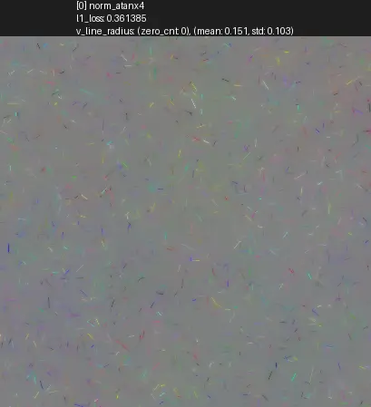

`smoothstep`:  

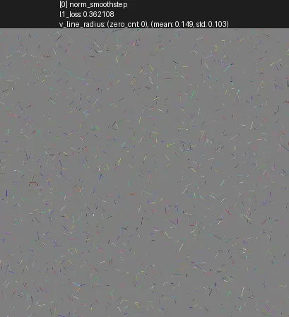

`tanh`:  
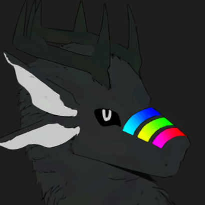
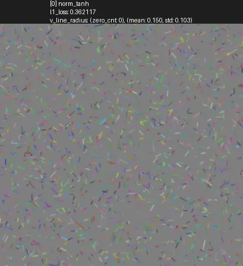

`sigmoid`:  
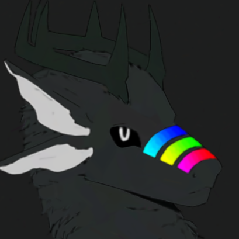


## Possible improvements

So.. we have proven it works, and the idea *is* solid.  So what's next?  

1. We barely touched the hyper-parameters, optimizers, and how initialization is performed.  
2. It *urgently* needs to be optimized, we are allocating a tensor of size `WxH` for *every* line, no matter if that line is visible or has a radius of zero. Which as you can imagine isn't great when we're trying to optimize thousands of lines on larger images (a 550x220 image with 5k lines takes up basically 30GiB of VRAM, which shows its innefficiencies).  
We can optimize it by splitting the area in which lines reside by 4 quadrants in the image, but this also has its own drawbacks (how will we deal with lines that go outside those quadrants?).  
Another way is to perform bucketing, why allocate a huge `NxWxH` tensor when we can allocate a `Nx16x16` tensor for all primitives that use less than 16x16 of screen space?  
I'm pretty sure DiffVG and alike are clever enough to pretty much not have this issue, but I haven't studied them in-depth yet so I can't say for certain.
3. Doing cooler stuff.  
No but seriously, so far we frankly just have optimized 2D images into 2D images, this same idea can be used for 3D geometry. But that will be for a much later date.

Of course we could solve most of these problems just by cloning DiffVG, but what's the fun in that?  
I would much rather test out [triton](https://triton-lang.org/main/index.html) or [taichi](https://www.taichi-lang.org/) than dealing with compiling DiffVG personally. That would also mean finding out the derivatives of complex functions by hand, but that's something I will need to learn one time or another either way.

## Conclusion

Well this concludes this blog post, I believe that differentiable rendering perfectly illustrates how there really isn't a wrong or right in ML, and that things that work great in one scenario work completely different in another.  
To give my own personal opinion about this, it isn't just about how useful differentiable rendering truly is, I think this is more about understanding and demonstrating why gradient descent is such a powerful algorithm for optimization problems. As you can imagine, this isn't limited to just optimizing lines to raster images.

## Acknowledgements

Special thanks to [Exulan](https://exulan.com) for providing the compute resources needed this!  
Demonstration images used courtesy of [Gummi_art](https://bsky.app/profile/gummiart.bsky.social) and [o_pastelzera](linktr.ee/o_pastelzera).
